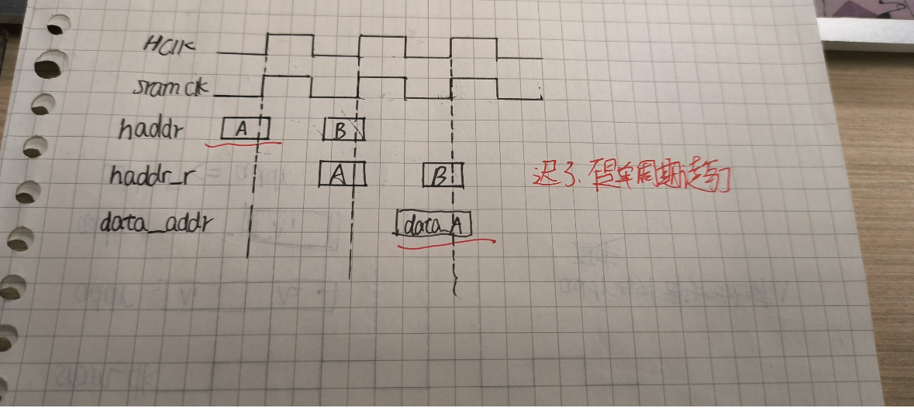
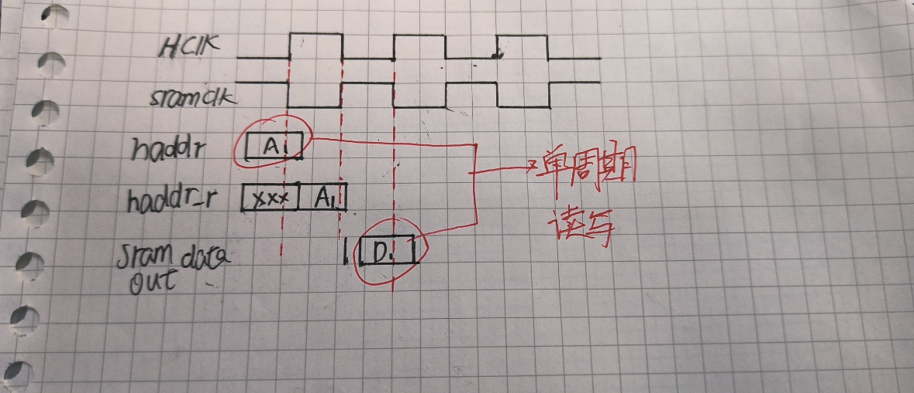
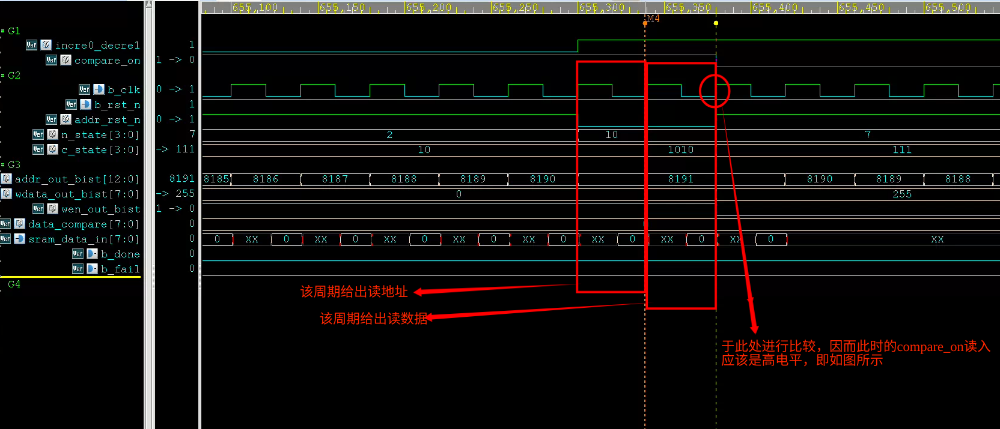

## 自我思考

### 1. 关于写地址打拍让其与数据对齐导致的各种事情

#### 1. 为什么写地址要打拍

因为在**AHB**总线中，是先给出写地址，再给出写数据。但是对于sram来说，数据与地址要**同时给出**，因而需要在ahb_slave_if这个转接口将输入进来的地址打一拍，同步/等待数据到来再一并送入sram

#### 2.这和读地址有什么关系

根本原因在于，**写地址与读地址共用一条地址线**！在axi协议中，读写通道是分离的，但是在ahb中，却不是分离的！

因而如果读地址也是沿用同样的方法，**并且在总线时钟与sram的时钟是相同的情况下**，输入的地址会被打一拍再送给sram，这样数据就不在ahb输入地址后的下个周期给出了，而下下个周期才能收到数据



**这时候有两种解决方法**

一是改变时钟，将sram_clk改为hclk的反向

这样的话，sram将在hclk的下降沿接收地址并然后寻址释放数据

当然这种情况下，留给data的时间就相当短了，因为又要考虑组合逻辑延迟与建立时间



另外一种，就是在读取状态下，将地址直接送入sram而不做任何的打拍动作，注意，将地址直接送入sram的时候，同时也要将其他控制信号（与地址同步的）也要一同送入

## 自设计之后的感想

### 1.开源的SRAM

我使用的的OpenRAM生成的SRAM，不得不说，设计得很好，虽然在ram功能上其实就是存储，但是能给出很多我想都不敢想的反馈信息.。但是也有缺点，比如它是下降沿生效，再比如，它将使能的更新放在了无效沿，导致我的测试时候第一个数据的无效(当然可能是我testbench写的不够专业，理论上来说确实应该要停一停等到所有信号有效的)

### 2.bist测试

**Bist（Build-in self test）**自建立测试，属于DFT的一种，百科介绍：**内建自测试**（英语：**built-in self-test, BIST**）是[可测试性设计](https://baike.baidu.com/item/可测试性设计/0?fromModule=lemma_inlink)的一种实现技术

我的bist实现使用了状态机，说实话，其实我并不怎么会用状态机，但这次基本已经明白状态机该怎么写了

```verilog
//状态机的写法
`define 	S0  4'b0000
`define 	s1 	4'b0001
`define 	s2	4'b0002
`define 	s3 	4'b0003
`define 	s4 	4'b0004

//用时序进行打拍
always @(posedge sram_clk or negedge sram_rst_n) begin
    if(!sram_rst_n) begin
       cstate <= S0; 
    end
    else begin
       cstate <= nstate; 
    end
end

//用组合逻辑进行n_state的选择
always @(cstate or b_en or addr) begin
    case (cstate) 
        `S0: begin
            if(条件判断)
                cstate = nstate;
        end
        
     	`s1: begin
            if(条件判断)
                cstate = nstate;
        end
        
        `s2:begin
            if(条件判断)
                cstate = nstate;
        end
        
        `s3:begin
            if(条件判断)
                cstate = nstate;
        end
        
        `s4:begin
            if(条件判断)
                cstate = nstate;
        end
    
end
```

关于bist那段代码，也有几个要说的

1. 关于地址的那一段，有递增与递减两个模式，切换模式的时候，需要进行复位。**复位信号是同步复位，也就是说，当前周期改变复位信号，效果在下个周期的沿才会生效。也就是说，地址才会进行复位到0，下下个周期的沿，地址才能被使用。**因而如果进行状态切换的时候，如果下个状态的地址需要复位，那么很可能需要在这个状态就要将复位信号拉低了。

   ```verilog
               `WRITE0: begin                              //递增写
                   if(addr_out_bist==13'h1fff) begin       //
                       n_state = `READ0;
                       addr_rst_n = 0;
                   end
                   else 
                       n_state = `WRITE0;
               end
   
               `READ0: begin                       //递增读
                   //上个周期使用了addr_rst_n进行复位，那么这个周期复位成功，地址变成了复位之后的地址
                   //并在这个周期将读信号有效，然后将复位信号降低                
                   //由于复位是同步复位，因而如果当前周期遇到的下一个时钟沿需要用地址
                   //就必须在当前周期的时钟沿读到复位信号，然后当前周期把复位后地址准备好
                  
                   //因此复位信号需要要上个周期就准备好，这个周期准备复位后地址，让下个周期的上升沿来读
                   addr_rst_n = 1;
                   wen_out_bist = 1;               //读状态
                   n_state = `COMPARE0;
               end
   ```

   比如这里，从写到读的状态切换，在最后一个写状态的时候，就需要将复位信号拉低，这样在进入读状态之后，**地址就会变成已经复位的地址**。同时在读状态的时候，将读写使能变为读有效。

   

   **其实在代码中最重要的一点是，这个复位信号是同步复位，它不会让地址的复位立即生效，因而需要提前一个周期将复位有效，这样在下个周期的时候，才会有复位地址**。而其他的在状态机内依据状态变化改变的信号（如切换到当前状态时将读使能拉低或者拉高、比较开关的开启，这些都是**组合逻辑，都是立即生效的，都是当前周期结束后，下个周期的上升沿到来之后立即就能用的那种**，而复位信号是同步，要打拍，需要多等待一个周期（复位信号生效需要多一个周期，然后在下个周期时，复位地址才能准备好，才能将其与读写使能一同送入SRAM））

   

2. **关于读状态与比较状态**，仔细看，我们的读状态实际上只维持了一个周期，然后就切换到了比较状态，这是怎么回事呢？

   读状态只是负责将读信号打开然后把复位信号拉回不复位状态。然后直到读状态再被拉回写状态时，它就会不停地读出信息。也就是说，当前周期给出地址，下个周期就给出数据并拿来比较，同时下个周期更新地址，类似于一种流水线的方式，这样每个周期就能比较一个数。**因而读状态只是负责开个头而已，开完这个头，sram就会不断读数据出来比较**。

   

   但这样也会导致另一个问题。由于这周期给出地址，下个周期给出数据进行比较，如果处于最后一个地址的时候就把 比较使能关闭，**那么下个周期的比较就没办法进行**，就会漏掉最后一个周期的数据不比较。

   

   **请注意一点，当前周期给出地址，下个周期给出数据，下下个周期时钟沿才会进行比较！因而下下个时钟沿接收到的比较状态必须是有效的，之后再下下个时钟沿之后再把信号拉低！**

   

因而需要多维持一个周期，即``COMPAREx_IDLE`。

再由到``WRITE1`将compare_on拉低

```verilog
            `READ0: begin                       //递增读
                //上个周期使用了addr_rst_n进行复位，那么这个周期复位成功，地址变成了复位之后的地址
                //并在这个周期将读信号有效，然后将复位信号降低                
                //由于复位是同步复位，因而如果当前周期遇到的下一个时钟沿需要用地址
                //就必须在当前周期的时钟沿读到复位信号，然后当前周期把复位后地址准备好
               
                //因此复位信号需要要上个周期就准备好，这个周期准备复位后地址，让下个周期的上升沿来读
                addr_rst_n = 1;
                wen_out_bist = 1;               //读状态
                n_state = `COMPARE0;
            end

            `COMPARE0: begin
                compare_on = 1;
                data_compare = 0;
                if(addr_out_bist == 13'h1fff) begin         //我理解了,这里确实是13'h1fff,当c_state切换到这个状态之后
                    n_state = `COMPARE0_IDLE ;              //当c_state切换到这个状态之后, 这里所用的所有数据都是当前拍的
                    addr_rst_n = 0;                         //而不是上一拍的输入
                    //这也说明了为什么,不是先有的13'h1fff再有的n_state=compare_idle
                    //而是两者共同进行的
                    //我差点忘了，状态机的状态切换是组合逻辑，因而用的是都是当前周期的数据做判断
                    //我当然知道这些代码都是组合逻辑，但是那个if判断的时候却用了时序逻辑。。。
                    incre0_decre1 = 1;

                end

                else begin 
                    n_state = `COMPARE0 ; 
                end
            end

            `COMPARE0_IDLE : begin          //由于地址为8191时数据需要下个周期才能出现
                n_state = `WRITE1;          //因而需要一个周期的维持，在下个数据比较完之后再进入写状态
            end

			`WRITE1: begin              //递减写
                compare_on = 0;                                   //
                wen_out_bist = 0;
                wdata_out_bist = 8'hff;
                addr_rst_n = 1;
                /*
                省略部分
                */
            end
```

**这里的比较是打拍比较，因而比较的数据都是上个周期准备好的数据。**


### AHB_slave接口的设置

假设我们所有的核都是买来的ip核，但是它只有部分可配置的接口

这时候就需要个接口，将输入信息重新调整，使得它能被ip（或者我们组合之后的ip）接收

在看过AXI4协议过后，重要的信息无非就是如此：

1. 系统信号
2. **地址与控制信号**
3. **数据信息**
4. **握手与响应信号**


#### 1.系统信号

系统信号就不必多说了，系统时钟与sram_clk还有系统复位、bist_en等信号

#### 2.地址与控制信号

同步时钟下：

对于读操作来说，地址与控制信号不需要打拍，直接送入到SRAM

对于写操作而言，地址与控制信号需要存一拍，等到数据到达之后，随数据一同送入SRAM

sram_clk = ~hclk下：

地址和控制信号都可以存一拍处理，这样会让时序比较紧张，但是不用分别区分操作


**地址信号中，低两位与[15]都用来片选**，其中[15]负责选上4片和下4片，低两位负责选4片中哪几片有效（**需要结合hsize**）

传输字节为32位，则4片全上; 传输字节为16为，则低两片或者高两片；传输字节为8，4片选一片

```verilog
    //3.对于地址操作与片选
    wire                            bank_sel;       //片选选哪片
   
    wire        [1:0]               bit_sel;        //位的选择，跟据值来指示byte_sel哪几位为高哪几位为低
    
    //注意一点，我们最高是32位，因而hsize指示32位时，不会使用bit_sel
    //hsize指示8位时，bit_sel有4个状态，分别指定4个位置
    //hsize指示16位时，看bit_sel的最高位，为1则是高16位，为为低则是低16位
    //不会出现16位只选中前8位和后8位的
    `ifdef HCLK_EQUAL_SRAM_CLK
        assign bank_sel =   hwrite ?  haddr_r[15] : haddr[15];
        assign bit_sel = hwrite ? haddr_r[1:0] : haddr_r[1:0] ;
    `else
        assign bank_sel = haddr_r[15];
        assign bit_sel = haddr_r[1:0];
    `endif
    
    wire        [3:0]               byte_sel;       //最终输出的片选结果，指明了一片中哪几个字节有效
    
    assign bank0_csn = ((bank_sel==1'b0)&&(hsel&&hready)) ?   byte_sel : 4'b1111; 
    assign bank1_csn = ((bank_sel==1'b1)&&(hsel&&hready)) ?   byte_sel : 4'b1111;

    wire        [2:0]               hsize_final;        

    `ifdef HCLK_EQUAL_SRAM_CLK
        assign hsize_final = hwrite ? hsize_r : hsize ;
    `else
        assign hsize_final = hsize_r ;
    `endif

    //读不需要打拍, 写需要打拍
    assign byte_sel = (hsize_final == 3'b010) ? 4'b0000 : 
                      (hsize_final == 3'b001) ?
                                         ((bit_sel[1])?4'b0011 : 4'b1100) :
                      (hsize_final == 3'b000) ? (
                                        ({4{bit_sel==2'b00}} & (4'b1110)) |
                                        ({4{bit_sel==2'b01}} & (4'b1101)) |
                                        ({4{bit_sel==2'b10}} & (4'b1011)) |
                                        ({4{bit_sel==2'b11}} & (4'b0111)) 
                      ) : 4'b1111 ; 
    //输出地址
    `ifdef HCLK_EQUAL_SRAM_CLK
        assign sram_addr_out = hwrite ? haddr_r[14:2] : haddr[14:2] ;
    `else
        assign sram_addr_out = haddr_r [14:2];
    `endif
 
```

对于大部分的控制信号，都已经打拍处理

```verilog
//2.针对需要打拍的那部分
reg         [31:0]              haddr_r;
reg         [1:0]               htrans_r;     
reg         [2:0]               hburst_r;  
reg         [2:0]               hsize_r;
reg                             hwrite_r;

//复位时重置一切、未被选择时不进行任何操作
always @(posedge hclk or negedge hrst_n) begin
    if(!hrst_n) begin 
        haddr_r <= 32'b0;
        htrans_r <= 2'b0;
        hburst_r <= 3'b0;
        hsize_r <= 3'b0;
        hwrite_r <= 1'b0;
    end

    else if(!(hsel&&hready)) begin
        haddr_r <= 32'b0;
        htrans_r <= 2'b0;
        hburst_r <= 3'b0;
        hsize_r <= 3'b0;
        hwrite_r <= 1'b0;
    end

    else begin
            haddr_r <= haddr;
            htrans_r <= htrans;
            hburst_r <= hburst;
            hsize_r <= hsize;
            hwrite_r <= hwrite;
    end
        
end
```

**读写使能还需要看htrans的值，但在判断htrans的值之前，还需要确定当前是读还是写，总之有点绕**

如果是读状态，那么就只需要经过htrans；如果是写，还需要判断hwrite_r是不是写状态，因为**写的控制信号和地址信号需要等一拍再与数据信息一同送入sram**

```verilog
//4.其余操作
    //wen是0则写状态,wen是1则是读状态
    //然而是否读写，需要htrans是seq或nonseq
    `define     IDLE    2'b00
    `define     BUSY    2'b01
    `define     NONSEQ  2'b10
    `define     SEQ     2'b11

    `ifdef HCLK_EQUAL_SRAM_CLK 
        assign  wen =  hwrite ? 
                   (    ((htrans_r == `SEQ) || (htrans_r ==`NONSEQ)) && (hwrite_r) ? 1'b0 : 1'bz 
                   ):
                   (    ((htrans == `SEQ) || (htrans == `NONSEQ)) ? 1'b1 : 1'bz       //如果是读状态，那么就不需要对hwrite_r进行判断
                   );
    `else
        assign wen = ((htrans_r == `SEQ) || (htrans_r ==`NONSEQ)) && (hwrite_r) ? 1'b0 : 1'b1;
    `endif
```

#### 3.数据信号

数据的读出

```verilog
    assign hrdata = !bank_sel ?  {sram_d_3,sram_d_2,sram_d_1,sram_d_0} : {sram_d_7, sram_d_6, sram_d_5, sram_d_4};
//bank_sel是0是选择3210片，是1是选择7654片
```

数据的写入

```verilog
    assign sram_wdata = hwdata;
```

#### 4. 握手信号

hresp 是代表 OKEY、EEROR、RETRY、SPLIT；这里常态代表OKEY

hready out 代表SRAM本身的ready状态

SRAM功能比较简单，因而常态保持OK以及一直ready（随时能读写）

```verilog
 assign      hresp = 2'b00; 
 assign      hready_out = 1'b1;
```

而对于输入进来的hready信号，解释如下：

```verilog
 //可以看成一对有效的使能信号吧
    input                           hsel,                   //指示当前slave是否被选中, 每个slave都有一个这样的信号
    input                           hready,                 
    //发起ready的源本应该是slave，但是slave同时也要接收来自slave的ready
    //通俗来说，接收hready是为了观测当期总线有没有人用。这里的hready是所有slave的一个ready输出的与
    //只要有一个slave在使用总线，hready就会被拉低，这时候其他slave就知道，总线其他slave使用，总线繁忙中


```


